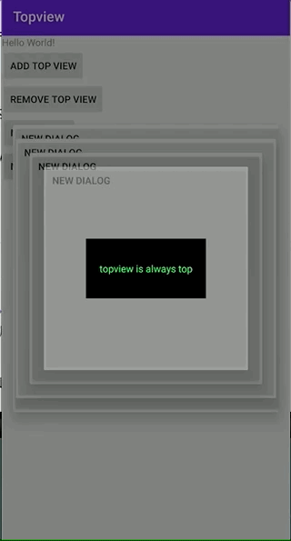

# topview
topview is a android UI tools for making a view always show in front of screen, but without permissions.

## How It Works

It works by hooking WindowManagerService proxy to detect view change, then re-add topview to make it always in front of screen。

## Geting Started

add implements in build.gradle

```groovy
implementation 'com.yangwawa:topview:0.0.3'
```

## Usage

add a view like the usage of windowmanger

```java
//create view
TextView tv = new TextView(context);
//create layout params
WindowManager.LayoutParams lp = new WindowManager.LayoutParams(WindowManager.LayoutParams.WRAP_CONTENT,WindowManager.LayoutParams.WRAP_CONTENT);
lp.width = 600;
lp.height = 300;
lp.type = WindowManager.LayoutParams.TYPE_APPLICATION;
lp.flags = WindowManager.LayoutParams.FLAG_NOT_FOCUSABLE;
lp.format = PixelFormat.TRANSLUCENT;
//add view
TopView.getInstance().addView(tv, lp);
```


